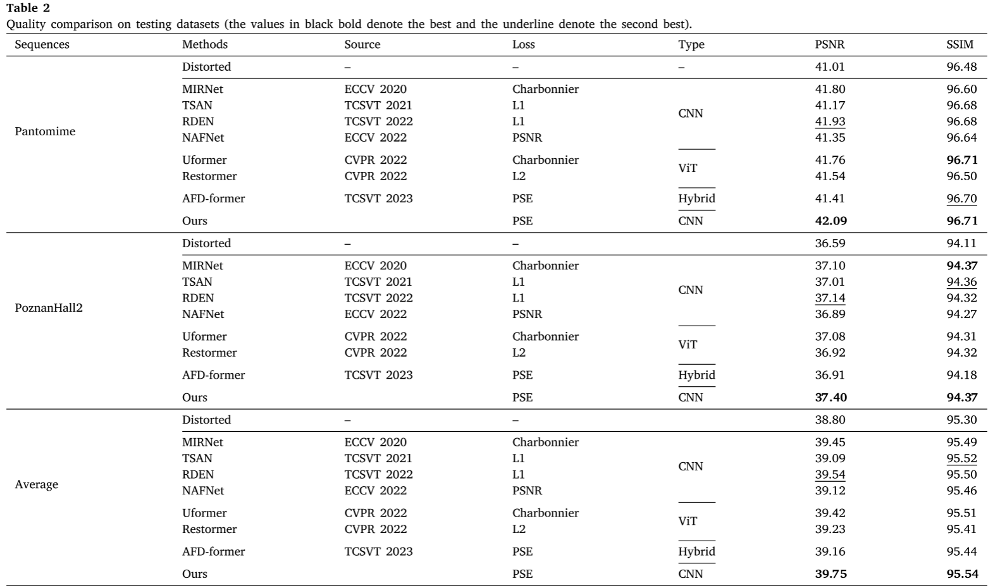

## TRRHA: A two-stream re-parameterized refocusing hybrid attention network for synthesized view quality enhancement  
<a href='https://www.sciencedirect.com/science/article/abs/pii/S0141938224002075'></a> 

Ziyi Cao<sup>1</sup>, Tiansong Li<sup>1</sup>, Guofen Wang<sup>1</sup>, Haibing Yin<sup>2</sup>, Hongkui Wang<sup>2</sup>, Li Yu<sup>3</sup>
<sup>1</sup>Computer and Information Science, Chongqing Normal University, 
<sup>2</sup>Communication Engineering, Hangzhou Dianzi University, 
<sup>3</sup>Electronic Information and Communications, Huazhong University of Science and Technology.

## 🔎 Framework


## 📊 Quantitative Evaluation

*Note: We respectfully clarify that the metric labeled as "SSIM" in the evaluation table refers to IW-SSIM. The reported numerical values are entirely correct.*

## 🎓 Citation
If you find this work useful for your research, please consider citing:
```bibtex
@article{CAO2024102843,
title = {TRRHA: A two-stream re-parameterized refocusing hybrid attention network for synthesized view quality enhancement},
journal = {Displays},
volume = {85},
pages = {102843},
year = {2024},
issn = {0141-9382},
doi = {[https://doi.org/10.1016/j.displa.2024.102843](https://doi.org/10.1016/j.displa.2024.102843)},
url = {[https://www.sciencedirect.com/science/article/pii/S0141938224002075](https://www.sciencedirect.com/science/article/pii/S0141938224002075)},
author = {Ziyi Cao and Tiansong Li and Guofen Wang and Haibing Yin and Hongkui Wang and Li Yu},
keywords = {3D-HEVC, Quality enhancement, Synthesized view, CNN, Re-parameterization},
}
